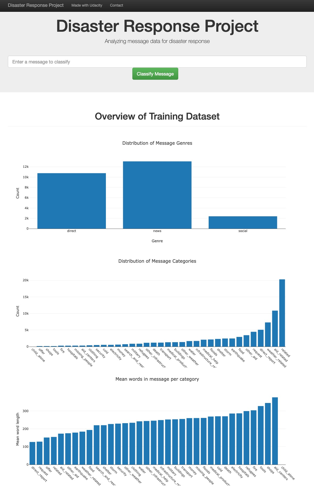
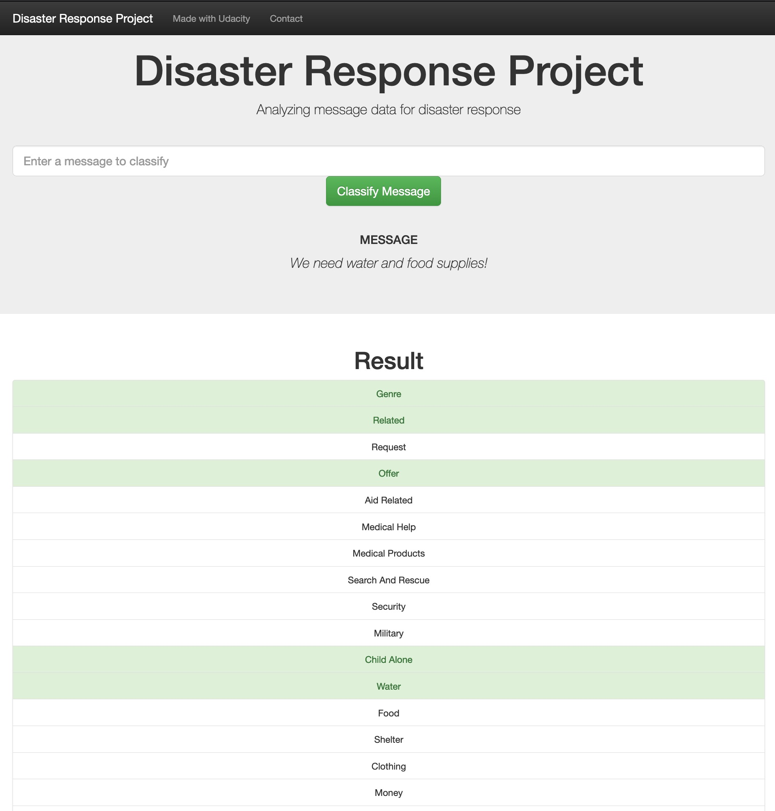

# Disaster Response Pipeline Project

## Overview
This projects trains a model that creates an API that classifies disaster messages. The messages were sourced from <a href='https://www.figure-eight.com'>Figure Eight</a>, which describe themselves as a Human-in-the-Loop machine learning platform.

The dataset used contains real messages that were sent during disaster events. A ML model is created that categories these messaged into 36 predefined categories so that the messages to an appropriate disaster relief agency.

The project also includes a web app that an emergency worker can use to input a new message and get classification results in several categories. The web app also has a few descriptive visualizations of the data.

## Getting Started

0.  Set up your virtual environment by running the following in Unix

Identify where your `python3` installation resides by running

    which python3

This should return something like `/usr/local/bin/python3`. Now we create a new python 3 virtual environment by running


    virtualenv -p /usr/local/bin/python3 venv


Now you can activate the virtual environment by running

    source venv/bin/activate

Lastly you can install the required packages by running:

    pip install -r requirements.txt

1.  Run the following commands in the project's root directory to set up your database and model.

1.1   To run ETL pipeline that cleans data and stores in database
s
```
python data/process_data.py data/disaster_messages.csv data/disaster_categories.csv data/DisasterResponse.db
```

1.2   To run ML pipeline that trains classifier and saves

```
python models/train_classifier.py data/DisasterResponse.db models/classifier.pkl
```
2.  Run the following command in the app's directory to run your web app.

```
python run.py
```

3.  Go to <http://0.0.0.0:3001/>

## The App

Below are 2 screenshots of the app. The first shows the summary visualizations for all the messages, and the second shows the view that the emergency agent will get if he inputs a messages.




